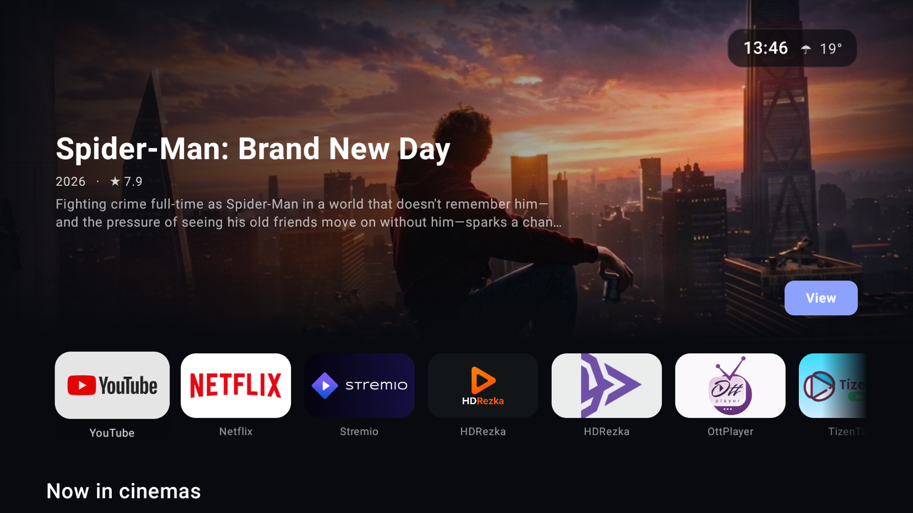

  

<h1 align="center">Reelora TV</h1>

  A fast, cinematic home launcher for Android TV—apps and fresh movies in one place.

  <a href="https://github.com/andiq123/reelora/releases/download/latest/ReeloraTV-latest.apk"><strong>Download the latest APK</strong></a>

## Made for the couch

Reelora combines a simple Apple TV-inspired app launcher with fresh movie discovery. Open installed TV apps immediately, then browse what is in cinemas, newly released, coming soon, and trending.

## Highlights

- Native installed-app discovery, one-click launching, and a local organizer for moving or hiding apps
- Optional Android home-screen role with a shortcut to choose the default launcher
- Smooth directional navigation with clear, stable TV focus states
- Current cinema releases, new movies, upcoming titles, and weekly trends
- Fast search with suggestions, the native TV keyboard, and voice input
- Rich title details with artwork, synopsis, ratings, genres, cast, trailers, and availability
- Embedded trailers plus an optional idle theater mode with persisted timing controls
- Compact release dates, provider badges, cast work, and relevant recommendations
- Optimized layouts for Android 11 televisions and Fire TV devices

## A clean home flow

A rotating current title sits above the customizable app shelf, followed by four concise discovery rows. Settings control app organization, theater timing, Android settings, and the default home app without cluttering the launcher.

## Install

Download **ReeloraTV-latest.apk** from the link above, allow installation from unknown sources on the TV, and open the APK. The package is updated automatically whenever a change lands on `main`.

Reelora is a personal launcher and discovery app, not a streaming service. Provider availability is informational and trailers play through YouTube inside the app.

## Data notice

This product uses the TMDB API but is not endorsed or certified by TMDB. Streaming availability data is supplied through TMDB's JustWatch integration.
