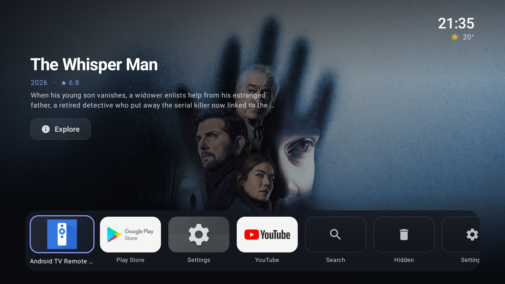

  

<h1 align="center">Reelora TV</h1>

  A calm, cinematic home launcher built for Android TV remotes.

  <a href="https://github.com/andiq123/reelora/releases/download/latest/ReeloraTV-latest.apk"><strong>Download the latest APK</strong></a>

## Your TV, simplified

Reelora blends an Apple TV-inspired app shelf with optional movie discovery. It opens directly into a focused, remote-first home screen where apps, time, weather, live match context, and entertainment recommendations feel like one coherent experience.

## Highlights

- **A real launcher** — discovers installed TV apps, launches them instantly, and can become the default Android home screen
- **Remote-first organization** — hold an app to move, rename, inspect, or hide it; restore hidden apps whenever needed
- **Two home experiences** — choose cinematic movie discovery or a distraction-free apps-only wallpaper mode
- **Smart football glance** — optional World Cup, Champions League, and Premier League fixtures, results, live scores, and timely hints
- **Useful at a glance** — persistent local weather, 12/24-hour clock, location search, Celsius or Fahrenheit
- **Cinematic discovery** — current releases, weekly trends, recommendations, rich artwork, cast, ratings, trailers, and availability
- **Search made for TV** — suggestions, native on-screen keyboard, and voice input
- **Ambient theater mode** — starts trailers after a configurable idle period and avoids recently shown titles
- **English and Romanian** — switch the complete launcher interface from Settings while competition names remain familiar
- **Fast by design** — stable focus, restrained GPU animations, lazy rows, cached data, and compact layouts for modest TV hardware

## Designed for the couch

The app shelf stays visually anchored while focus moves. Selected tiles lift outside their artwork instead of zooming the icon, dialogs retain the current wallpaper or movie backdrop, and every important action is reachable with directional keys, OK, Back, or Menu.

Settings keep customization in one place: home mode, wallpapers, app labels, focus style, football, weather, language, theater timing, hidden apps, and Android launcher controls.

## Install

Download **ReeloraTV-latest.apk** above, allow installation from unknown sources, and open it on an Android 11+ TV or Fire TV device. A fresh signed APK is published automatically whenever `main` changes.

Reelora is a personal launcher and discovery app, not a streaming service. Provider availability is informational and trailers play through YouTube inside the app.

## Data notice

This product uses the TMDB API but is not endorsed or certified by TMDB. Availability is supplied through TMDB's JustWatch integration. Weather comes from Open-Meteo, wallpapers from Picsum Photos, and football fixtures from TheSportsDB.

## What’s new in 0.20.0

The app shelf opens independently of movie requests. Discovery rows are lazy in both directions; backdrops stay still; movie rotation pauses behind dialogs, offscreen, and while another app is open. Apps-only mode skips movie loading. Weather and football refreshes pause in the background and retain their last result.

Artwork uses a shared cache capped at the smaller of 24 MiB or one-twelfth of the app heap, plus 96 MiB on disk. Detail and cast-credit caches have bounded entry counts. Search cancellation closes its network call, and returning from another app reuses installed app icons unless a package has changed.

The visual refresh improves contrast, allows two-line movie titles, places actions below their description, and simplifies the shelf and settings surfaces. Focus outlines remain clear for TV remotes.

See [the audit and validation notes](docs/performance-audit.md) for findings, measured observations, and physical-TV checks. Build a local APK with `./gradlew assembleRelease`; run checks with `./gradlew testDebugUnitTest lintDebug`.

Movie search is available directly on the app shelf in both home modes. Settings includes **Check for updates**: it checks the GitHub release on demand, downloads a newer APK through Android, verifies its checksum, package, and signing certificate, then opens Android’s installer. Allow installation from Reelora when Android asks. Updates require the same signing key as the installed app; local debug-signed builds cannot upgrade a production-signed installation.

## Discovery and navigation refinements in 0.21.0

Coming soon now uses future primary release dates, with a second local date check. Catalog data refreshes at midnight or after six hours while Home is active. Unavailable APIs no longer produce invented movie titles, cast members, genres, or runtimes. Unrated titles show “Not rated”.

Settings uses a category sidebar and a stable update footer. Hidden apps adapts to the TV viewport and restores focus after returning apps to Home. Search has Clear and Retry actions, distinguishes unavailable search from no results, and retains results when returning from movie details. Idle theater mode pauses while a dialog is open.

Dialogs use a single short transition, with platform window animations disabled. Movie details keeps its backdrop consistent and reserves metadata space to avoid layout jumps as data arrives.

## Interaction polish in 0.22.0

Holding OK opens a compact app-action list. Release the button, then press again to choose: continued holds cannot activate the first action. The same protection applies across dialogs and Move mode. App-menu actions finish their short exit transition before changing screens or the dock. Rename cancellation returns to the app menu.

Hide and restore use brief item transitions with stable app keys. Hiding focuses the neighboring app; closing Hidden apps after a restore focuses the restored app in its original dock position. Move mode keeps directional navigation on the dock until OK or Back finishes it.

## Startup and return-to-Home in 0.23.0

Opening Reelora from the app list now routes into its Home task before constructing the UI. Returning from another app reuses that same launcher instance, including dock focus and cached artwork. Previously, app-list and Home entry could leave two launcher activities alive.

Discovery and weather wait until the app shelf is ready, then allow a short settling period before refresh work. Existing content remains visible while refreshing; returning to a resident launcher does not rescan installed apps unless packages changed. Android startup reporting now marks shelf readiness separately from the first window.

Use `python3 scripts/profile-startup.py SERIAL OTHER_APP_COMPONENT` with Android's `adb` on PATH to reproduce the entry/return checks. Sample emulator timings and their limitations are recorded in [the audit](docs/performance-audit.md).

## Low-resource defaults in 0.24.0

Automatic trailers are now opt-in; saved settings remain respected. Android-designated low-RAM devices use at most 8 MiB for the artwork memory cache; other devices retain the 24 MiB cap, and both are further limited to one-twelfth of the app heap. Optional detail/actor caches are released when the UI is hidden, and Android background-memory pressure can clear the artwork cache without creating a new loader.

Back from discovery returns to the dock, and Back at Home keeps the launcher open. Apps-only focus no longer resets on every hide/restore. Search and detail requests pause with the activity; completed search results remain available on return.

## Theater codec selection in 0.24.1

Removed the unconditional AV1-blocking script from the embedded YouTube player. WebView now reports its native codec support, leaving adaptive quality selection to YouTube. This removes an app-imposed restriction; it does not force the highest resolution or guarantee an increase in quality. YouTube no longer supports programmatically setting embedded-player quality through its public API. No quality polling, extra player, or dependency was added.

## Remote navigation fix in 0.24.2

Hero Down now returns to the last focused dock item, including Search, Hidden, and Settings. It brings that item into view before requesting focus, so scrolling to the right end of a lazy row cannot leave the hero pointing to a disposed first app. App identity is retained across reordering, with a safe fallback after removal. Moving up from movie rows preserves the dock position; moving down again restores the previous first-row movie position.

Run `python3 scripts/check-tv-navigation.py SERIAL` with `adb` on PATH and movie Home enabled to check repeated far-right dock/movie round trips.

## Native device settings in 0.24.3

Settings → System → **Device settings** opens the TV's own network, display, sound, and system controls. Native settings, Default home, and App info open outside Reelora's Home task, so a Home-task redirect cannot clear their screens. Back preserves Reelora's settings position. Unsupported vendor pages fall back to the main device settings, with a message if neither is available.

Run `python3 scripts/check-device-settings.py SERIAL` with `adb` on PATH to check native settings task isolation, navigation, and return on a TV using the English interface.
