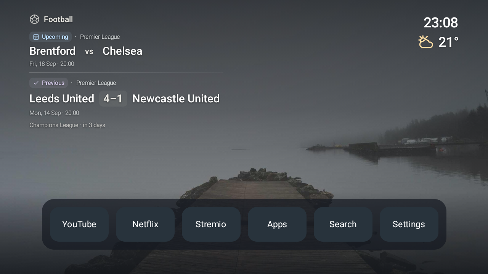
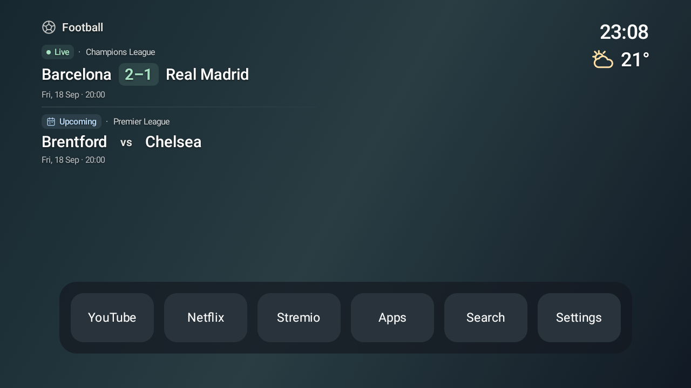
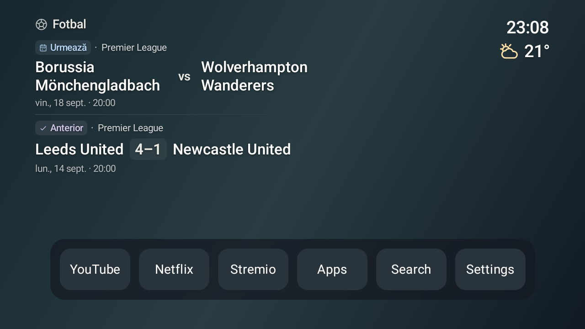

# Widget design review

Local Android TV emulator, Android 12, 1080p for the first two passes and 720p for the final stress checks. These screenshots render the production Compose widgets. Match/weather values and the dock are illustrative debug fixtures, not live data. The TV was not used during this iteration.

## Critique loop

1. **Original layout:** stretched across 70% of the display; team names, scores, and dates were separated by excessive space. Capitals and repeated blue labels gave every element similar emphasis.
2. **First local pass:** constrained the widget and softened the palette, but a fixed score column indented short names and forced Newcastle United onto two lines. Rejected.
3. **Second local pass:** removed fixed columns. Teams and scores now form natural-width, left-aligned groups. Standard fixture names fit one line; unusually long names can wrap without overlapping scores. Upcoming fixtures use a restrained blue label; completed matches keep neutral score text; mint marks live scores.
4. **Final contrast pass:** a light photo exposed weak secondary text contrast. Extended the existing wallpaper scrim behind the upper content, without adding a widget panel. Kept the weather display large, with no perpetual animation. Simplified the competition hint so it describes the next fixture rather than claiming the competition itself starts then.

5. **Group refinement:** separated Upcoming and Previous (or Live and Upcoming) with a quiet fading rule. Compact blue calendar, lavender check, and mint live badges distinguish match states without adding panels or constant animation. Rechecked all 12 scenarios, including enlarged Romanian text.

## Final preview







## Coverage and limits

Captured ready, photo background, bright background, live score, long team names, initial loading, offline, retained/stale content, clear night, rain, snow/negative temperature, and Romanian at 1.3× system text size. No widget/dock overlap was observed in the checked layouts. Standard names stay on one line; very long names wrap to at most two lines, then ellipsize. This is a visual layout check, not a claim that every locale or font scale has been tested.

All 29 unit tests, lint, debug build, and minified release build passed. The release manifest contains no preview activity. Debug fixtures and their wallpaper live only in `app/src/debug`.

## Repeat

Build and install `app/build/outputs/apk/debug/app-debug.apk` on a local Android TV emulator, then run:

```sh
PATH="$HOME/Library/Android/sdk/platform-tools:$PATH" python3 scripts/preview-widgets.py emulator-5554
```

The script refuses physical devices, saves screenshots to `/tmp/reelora-widget-previews`, and restores the emulator's font scale. The sample photo is from the app's existing wallpaper provider, [Picsum](https://picsum.photos/seed/reelora-design/1920/1080), and is used only by the debug preview.
